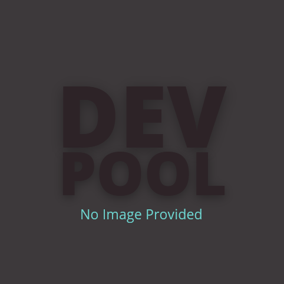
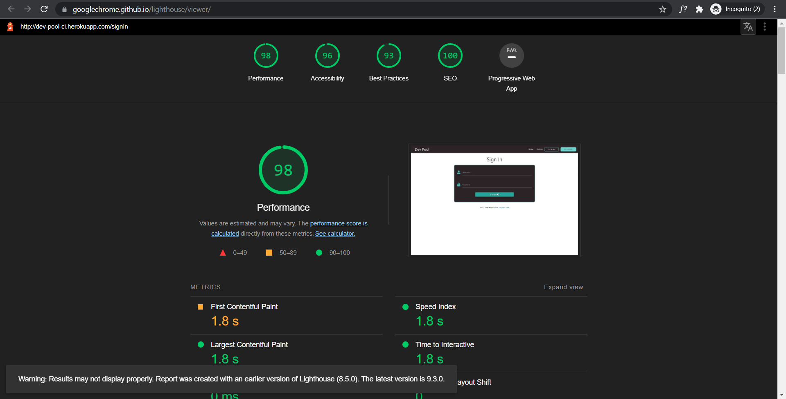

# Dev Pool


## [Live Site](https://dev-pool-ci.herokuapp.com/)

Dev Pool is a pool of resources for developers. It is a site where developers can explore assets that might come in useful throughout their career. Dev Pool can also be a great place to share useful assets with others in the community.

## Navigation
[Inspiration](#inspiration)

[UX](#ux)
- [Project Goals](#project-goals)
- [User Stories](#user-stories)
- [Design](#design)
- [Images](#images)

[Features](#features)

[Database](#database)

[Deployment](#deployment)
- [Configuring Enviroment Variables](#configuring-enviroment-variables)
- [Deployment to Heroku](#deployment-to-heroku)
- [Fork the GitHub Repository](#fork-the-github-repository)

[Testing](#testing)
- [Code Validation](#codevalidation)
- [Lighthouse Testing](#lighthouse-testing)
- [Testing User Stories](#testing-user-stories)

[Technologies, Languages & Frameworks](#technologies)

## Inspiration
Inspiration for this project came from scrolling through instagram and seeing posts sucdh as "5 resources every developer needs to know" or "Top 10 extensions to improve your coding!"

After creating a file on my computer to save all these assets, I thought having a site where developers can pool their useful resources and share them with the wider community would be a better and very much in the spirit of the dev community.

[Back to Top](#navigation)
## UX
### Project Goals
This site is aimed at developers who want to find new resources which will help them in their work. It is also a site where users can share their own resources with the wider developer community.

## User Stories
### User Goals
1. As a user I want to find useful resources related to software development.
2. As a user I want to share useful resources with the community
3. As a user I want to easially navigate to an interesting assets site.
4. As a user I want to have the option to delete the  assets that I upload
5. As a user I want the option to edit the assets that I upload.
6. As a user I want to be able to search for specific assets.
7. As a user I want to be able to create a profile.
8. As a user I want to be able to view all the assets that I have uploaded.

### Site Owner Goals
1. As a site owner I want to create new categpries as needed.
2. As as site owner I want to be able to edit categories.
3. As as site owner I want to be able to delete categories.
4. As as site owner I want to learn about new assets in the community.
5. As as a site owner I want to share my own assets with the community.

[Back to Top](#navigation)

# Design
This is a multi-page site consisting of 6 pages.
- Home
    - Explore Section
- Profile
- Create Asset
- Manage Categories
- Sign In
- Register

I used [Materialize CSS](https://materializecss.com/) for many of the UI components in this project such as cards, responsive navigation, modals and forms. This has been my first time using Materialize and overall I enjoyed how responsive its componants are and its ease of use.

## Colors
The colors in this site simple but wanted to use colors I thought developers might find familiar. I chose a dark grey similiar to that of GitHub or VSCode. I chose a blue/green which I thought felt kinda techy. I chose the off white to reduce eye fatigue for users. I chose the red to signify negitive user actions such as deleting.

I used [Coolors](https://coolors.co/) to help pick the color pallet for this site.

| Color Use  | HEX Code  | Color  |
|------------|-----------|--------|
|Buttons & Borders | #6DD3CE |  |
|Cards, Forms, Hero Container & Dark Headers/Text | #2D2327 |  |
|Background & Light Headers/Text | #F0E2E7 |  |
|Delete Buttons & Borders | #d71f53 |  |

## Images
The only image used in development of this site is a placeholder image which is put in place when users choose not to upload an image/logo of the asset that they are sharing. I created this placeholder image using [Canva](https://www.canva.com/)


[Back to Top](#navigation)

# Features

## Common Features
- ### Responsive Navigation
    - Displayed across all pages directs users through the site.
    - Displays different links depending on users being signed in or not.

Default Navigation


Registered User Navigation


Admin Navigation


## Feature 1 - Home Page

Home Page

- The Home Page is where first time users can register a new account and learn more about the site.
- For returning users the Home page provides a link to sign in and create new assets.
- Both registerd and unregistered users have access to the explore section and can view all assets.

## Feature 2 - Explore Section

Explore Section


- The Explore section is the main section on the site where users get to search and explore all the assets shared by the Dev Pool community.
- Search Box where users can search for specific assets by category, name or key words. 
- Registered Users will see the option to Add New Asset beside or under the search box.
- Each asset is displayed in a card. All cards are consistant in their layout. Displaying the Category, an Image, Name, Link and the option to reveal the description along with when and who the asset was added by.
- Users who have added assets will also see a button to edit their card in the top right corner.

## Feature 3 - Sign In / Register

Sign In Page


Register Page


- Both of these pages offer a form for users to complete and once completed successfully will redirect them to their Profile Page.

## Feature 4 - Profile Page

Profile Page


- This is the first page wusers see when they are signed in.
- If the user is newly registered or has not yet added any asset to the dev pool then they will have the option to Add New Asset. 
- If users have already added assets, they will be shown how many they have added and will see all their assets listed below.

## Feature 5 - Create Asset

Create Asset Page


- Users who want to share a new asset to the dev pool will be redirected to this form.
- This is simply a form for users to fill out and add relevant information about the asset such as:
    - Name
    - Category
    - Description
    - Site URL
    - Date Added
    - Site Image

## Feature 6 - Manage Categories (Admin Only)

Manage Categories


- From this page admin can Add, Edit and Delete categories from the dev pool.

[Back to Top](#navigation)

## Future Features
Like Button
- I would like to add a button where users can see how many developers have liked an asset.

Pagination
- I would like to add pagination in the future. It will make it easier for users to navigate the site as more assets are added to the dev pool.

Featured Assets
- I would like to create a carousel of some of the most liked assets in the dev pool.

Newsletter / Monthly Updates Sign Up
- I would like to develop a way for users to subscribe to get automated monthly updates on some of the newest assets added to the dev pool.


# Database
I used [MongoDB](https://www.mongodb.com/) to store and serve the data inputted by users. I chose to use MongoDB because I felt it was more flexiable for this project compared to a relational database like SQL.


[Back to Top](#navigation)

# Deployment

## Configuring Enviroment Variables
1. Create a `env.py` file to store senstive information
2. Create a `.gitignore` file to prevent senstive information from being pushed to GitHub.
3. Add `env.py` file to the `.gitignore` file
4. Within the `env.py` file
```
import os

os.environ.setdefault("IP", "0.0.0.0")
os.environ.setdefault("PORT", "5000")
os.environ.setdefault("SECRET_KEY", "SECRET KEY")
os.environ.setdefault("MONGO_URI", "MONGODB CONNECTION STRING")
os.environ.setdefault("MONGO_DBNAME", "DATABASE NAME")
```

## Deployment to Heroku
1. To tell Heroku which apps and dependencies are needed to run the app create a `requirements.txt` file 
``` pip3 freeze --local > requirements.txt ```
2. Create a Procfile ``` echo web: python app.py > Procfile ```
3. Go to [Heroku](https://www.heroku.com/)
4. Click "New" --> "Create New App.
5. Give the app a unique name (all lowercase with either underscores or minus instead of spaces).
6. Select a region
7. Click "Create App"
8. Navigate to "Deploy"
9. Select deployment from GitHub
10. Make sure your GitHub profile is displaying
11. Search for the correct repo and "Connect"
12. Got to Settings
13. Add Config Vars
14. Add the environment variables hidden in the ```env.py``` file

|||
|----|----|
|IP|0.0.0.0|
|PORT|5000|
|SECRET_KEY|SECRET KEY|
|MONGO_URI|MONGODB CONNECTION STRING|
15. Commit the `requirements.txt` and `Procfile` to Github
16. Go to [Heroku](https://www.heroku.com/)
17. Navigate to Deploy
18.	Enable Automatic Deployment
19. Deploy Branch
20. A button will appear if successful


Log into your [GitHub](https://github.com/) account.

## Fork the GitHub Repository

1. Log into [GitHub](https://github.com/) and find the repository.
2. Click the 'Fork' button located in the top right of the page.
3. This will make a copy of the repository on your own GitHub account.

## Clone this Repository

To make a local clone of this repository follow these steps:
1. Log into [GitHub](https://github.com/) and find the repository.
2. Click on the 'Code' button.
3. To clone the repository using HTTPS, copy the url.
4. Open Git and change the current working directory to where you want the cloned directory to be made.
5. In the terminal type 'git clone' followed by the https url.
6. Press enter
7. The local clone will be created.

[Back to Top](#navigation)

# Testing

## Code Validation

### HTML Validation
I used [W3C Markup Validation Service](https://validator.w3.org/) to validate the HTML Code.
I initially got a couple of errors such as having a h3 element inside of span, using max instead of maxlength and having an unclosed div. After I fixed these issues the validation came back with only one warning, that being related to the flashed messages.


### CSS Validation
I used [W3C Markup Validation Service](https://validator.w3.org/) to validate the CSS Code.
I got no errors or warnings.


### Javascript Validation
I used [JSHint](https://jshint.com/) to validate the JavaScript code.
This came back with no errors or warnings


### Python Validation
I used [PEP8 Online Checker](http://pep8online.com/) to check that my python code conformed to PEP8 best practices.
This came back with no warnings or errors


## Lighthouse Testing
- Home Page


- Home Page Mobile


- Profile Page


- Profile Page Mobile


- Create Asset Page


- Create Asset Page Mobile


- Categories


- Categories Mobile


- Create Category


- Create Category Mobile


- Sign In Page


- Sign In Page Mobile


## Testing User Stories
### User Goals
|||
|---|---|
|1. |As a user I want to find useful resources related to software development.|

- Users can find useful resources in the dev pool by using the "Explore" button in the nav bar or the hero box. This will bring them to the Explore section where they can brouse all assets shared by the community.

|||
|---|---|
|2. |As a user I want to share useful resources with the community|

- Any user that registers an account will have the option to share resources with the community. This can be done from the main navigation, their profile page or the top of the explore section.

|||
|---|---|
|3. |As a user I want to easially navigate to an interesting assets site.|

- Users have the option on each card to navigate to the asset site by clicking the "GO to Site" button on the card front and within the card reveal.

|||
|---|---|
|4. |As a user I want to have the option to delete the  assets that I upload|

- Users who upload an asset will have the option to delete it by clicking on the "Edit" button in the top right of the asset card. This will pop up the edit form with the option to delete the asset at the bottom. On user click a modal will pop up to make sure that the user wants to delete that asset to prevent an accidental delete.

|||
|---|---|
|5. |As a user I want the option to edit the assets that I upload.|

- Users have the option to edit their  assets by using the "Edit" button in the top right of the card. This opens up a form and users will be able to update the information on the card.

|||
|---|---|
|6. |As a user I want to be able to search for specific assets.|

- The search bar at the top of the Explore section will allow users to search assets by Name, Category or Keyword.

|||
|---|---|
|7. |As a user I want to be able to create a profile.|

- Users can create a profile by using the register button located in the nav bar or in the hero container. A profile will be created using the name that they registered with and will display a button to encourage them to share a new asset with the community.

|||
|---|---|
|8. |As a user I want to be able to view all the assets that I have uploaded.|

- Signed in users will be able to see how many assets they have uploaded to the dev pool by acessing their profile from the nav bar.


### Site Owner Goals

|||
|---|---|
|1. |As a site owner I want to create new categpries as needed.|

- Using the "Manage Categories" link in the nav bar admin can create new categories using the "Add Category" button at the top of the page.

|||
|---|---|
|2. |As as site owner I want to be able to edit categories.|

- Admin can edit each category using the blue "Edit" button located in each category card.

|||
|---|---|
|3. |As as site owner I want to be able to delete categories.|

- Admin can delete any category using the red "Delete" button located in each category card.

|||
|---|---|
|4. |As as site owner I want to learn about new assets in the community.|

- Admin can avail of the entire catalogue of resources in the dev pool using the Explore button in the nav bar and browsing through the assets.

|||
|---|---|
|5. |As as a site owner I want to share my own assets with the community.|

- Admin will have the option to share their own resources with the community. This can be done from the main navigation, their profile page or the top of the explore section. 

[Back to Top](#navigation)

## Bugs in Development
Bug - First category in the list being deleted no matter what one was selected.

(I fixed this using a thread by igor_ci on the code institute slack channel.)

Fix - I had to give each modal and delete button a unique id. I did this by putting the category and the delete button in a jinja for loop and adding {{ loop.index }} to bothe the moadal and button.
```
     <!-- Delete Button Modal Trigger -->

    <a class="btn-solid-red btn modal-trigger card-panel-btn" href="#modal{{ loop.index }}">Delete</a>

     <!-- Modal Structure -->

    <div id="modal{{ loop.index }}" class="modal">
    ...
    <!-- Modal Content -->
    ...
    </div>

```

Bug - When I clicked the explore link in the nav bar from any page other than home page the link would work correctly but when I clicked the link from the home page the link didn't work.

I found the fix for this using stack overflow [Here](https://stackoverflow.com/questions/65297198/is-there-a-way-to-go-to-a-specific-part-of-html-page-with-flask).

Fix - I used a combination of a jinja if statement to check if user is on the home page or not. If the user was I simply used an `<a>` link with the href set to #explore. If the user was not I used the url_for with an _anchor set to explore.
```
<!-- Explore Nav Link -->


    <li class="nav-link"><a href="#explore">Explore</a></li>

    <li class="nav-link"><a href="{{ url_for('get_assets', _anchor='explore')}}">Explore</a></li>


```

Bug - I had trouble updating assets on the database.

Thanks to John a tutor from Code Institute for helping me with this bug

Fix - I had to use the [$set operator](https://docs.mongodb.com/manual/reference/operator/update/set/) to replace the existing values in the DB with the new values. This initially didn't work because I was using the update() function which is depreciated. I instead had to use update_one() which worked.

```
# Edit Asset

@app.route("/edit_asset/<asset_id>", methods=["GET", "POST"])
def edit_asset(asset_id):
    if request.method == "POST":
        submit = {
            "category_name": request.form.get("category_name"),
            "asset_title": request.form.get("asset_title"),
            "asset_description": request.form.get("asset_description"),
            "asset_url": request.form.get("asset_url"),
            "date_added": request.form.get("date_added"),
            "asset_image": request.form.get("asset_image"),
            "asset_creator": session["user"]
        }
        mongo.db.assets.update_one(
            {"_id": ObjectId(asset_id)}, {"$set": submit})
        flash("{} Updated Successfully".format(
            request.form.get("asset_title")))
        return redirect(url_for('get_assets'))

    asset = mongo.db.assets.find_one({"_id": ObjectId(asset_id)})
    categories = mongo.db.categories.find().sort("category_name", 1)
    return render_template(
        "edit_asset.html", asset=asset, categories=categories)
```

[Back to Top](#navigation)

# Technologies
### Languages
- [HTML](https://developer.mozilla.org/en-US/docs/Web/HTML) is used for creating the structure of the site.
- [CSS](https://developer.mozilla.org/en-US/docs/Web/CSS) is used for adding custom styling.
- [JavaScript](https://www.javascript.com/) used to add logic to the site and initialize materialize css componants.
- [Python](https://www.python.org/) is used to add functionality to the pages and for acessing the database.

### Frameworks, Libaries and Programs
- [MaterializeCSS](https://materializecss.com/) is used to add responsiveness and styling to the site.
- [Flask](https://flask.palletsprojects.com/en/2.0.x/) used as a python framework
- [Jinja](https://jinja.palletsprojects.com/en/3.0.x/) used for templating.
- [MongoDB](https://www.mongodb.com/) used for the database.
- [Heroku](https://id.heroku.com/login) used to deploy the site.
- [jQuery](https://jquery.com/) a JavaScript libary used to make the site interactive.
- [Werkzeug](https://werkzeug.palletsprojects.com/en/2.0.x/) used to create secure user authentication.
- [RandomKeygen](https://randomkeygen.com/) is used to create the secret key used in the env.py file
- [Font Awsome](https://fontawesome.com/) used for icons
- [Coolors](https://coolors.co/) used to create the color palette
- [GitHub](https://github.com/) is used as a remote repository for the projects source code.
- [Git](https://git-scm.com/) was used to commit and push the code to GitHub.
- [Gitpod](https://www.gitpod.io/) used as the development environment.
- [Am I Responsive](http://ami.responsivedesign.is/) used to create the responsive image at the top of the README.

[Back to Top](#navigation)

# Credits
### Code
- [Code Institute](https://codeinstitute.net/global/) was a fantastic resource for learning throughout this project. Using the Task manager Mini Project lessons helped me through many parts of this project.

- The code to fix the issue with no validation Materialize dropdown was taken from [Code Institutes](https://codeinstitute.net/global/) Mini Project lesson on Materialize Form Validation

- The code to initialize Materialize interactive elements on the site was taken from the [Materialize Documentation](https://materializecss.com/).

- Code for error handling was taken from [Flask Documentation](https://flask.palletsprojects.com/en/1.1.x/patterns/errorpages/).

## Acknowledgements
I would like to say a huge thank you to all the Code Institute Tutors for their help along the way. They have been fantastic with their patience and knowledge in helping me with any difficulties I faced.

I would like to say thank you to Code Institute for providing me with an exceptional program and learning resource.

A huge thank you to everyone on the course Slack Channels who have been very suportive and helpful.

[Back to Top](#navigation)
