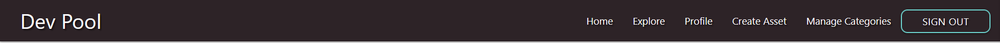
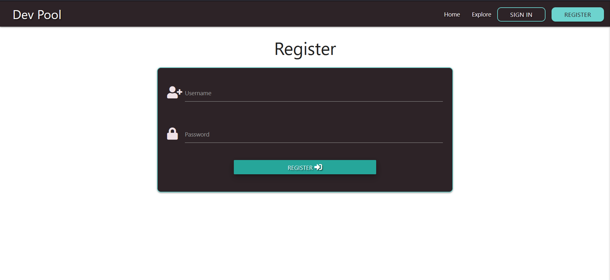

# Dev Pool

Dev Pool is a pool of resources for developers. It is a site where developers can explore assets that might come in useful throughout their career. Dev Pool can also be a great place to share useful assets with others in the community.

## Inspiration
Inspiration for this project came from scrolling through instagram and seeing posts sucdh as "5 resources every developer needs to know" or "Top 10 extensions to improve your coding!"

After creating a file on my computer to save all these assets, I thought having a site where developers can pool their useful resources and share them with the wider community would be a better and very much in the spirit of the dev community.

## Navigation

## UX
### Project Goals
This site is aimed at developers who want to find new resources which will help them in their work. It is also a site where users can share their own resources with the wider developer community.

## User Stories
### User Goals
1. As a user I want to find useful resources related to software development.
2. As a user I want to share useful resources with the community
3. As a user I want to easially navigate to an interesting assets site.
4. As a user I want to have the option to delete the  assets that I upload
5. As a user I want the option to edit the assets that I upload.
6. As a user I want to be able to search for specific assets.
7. As a user I want to be able to create a profile.
8. As a user I want to be able to view all the assets that I have uploaded.

### Site Owner Goals
1. As a site owner I want to create new categpries as needed.
2. As as site owner I want to be able to edit categories.
3. As as site owner I want to be able to delete categories.
4. As as site owner I want to learn about new assets in the community.
5. As as a site owner I want to share my own assets with the community.

# Design
This is a multi-page site consisting of 6 pages.
- Home
    - Explore Section
- Profile
- Create Asset
- Manage Categories
- Sign In
- Register

I used [Materialize CSS](https://materializecss.com/) for many of the UI components in this project such as cards, responsive navigation, modals and forms. This has been my first time using Materialize and overall I enjoyed how responsive its componants are and its ease of use.

## Colors
The colors in this site simple but wanted to use colors I thought developers might find familiar. I chose a dark grey similiar to that of GitHub or VSCode. I chose a blue/green which I thought felt kinda techy. I chose the off white to reduce eye fatigue for users. I chose the red to signify negitive user actions such as deleting.

I used [Coolors](https://coolors.co/) to help pick the color pallet for this site.

| Color Use  | HEX Code  | Color  |
|------------|-----------|--------|
|Buttons & Borders | #6DD3CE |  |
|Cards, Forms, Hero Container & Dark Headers/Text | #2D2327 |  |
|Background & Light Headers/Text | #F0E2E7 |  |
|Delete Buttons & Borders | #d71f53 |  |

## Images
The only image used in development of this site is a placeholder image which is put in place when users choose not to upload an image/logo of the asset that they are sharing. I created this placeholder image using [Canva](https://www.canva.com/)

# Features

## Common Features
- ### Responsive Navigation
    - Displayed across all pages directs users through the site.
    - Displays different links depending on users being signed in or not.

Default Navigation

Registered User Navigation

Admin Navigation

## Feature 1 - Home Page

Home Page

- The Home Page is where first time users can register a new account and learn more about the site.
- For returning users the Home page provides a link to sign in and create new assets.
- Both registerd and unregistered users have access to the explore section and can view all assets.

## Feature 2 - Explore Section

Explore Section

- The Explore section is the main section on the site where users get to search and explore all the assets shared by the Dev Pool community.
- Search Box where users can search for specific assets by category, name or key words. 
- Registered Users will see the option to Add New Asset beside or under the search box.
- Each asset is displayed in a card. All cards are consistant in their layout. Displaying the Category, an Image, Name, Link and the option to reveal the description along with when and who the asset was added by.
- Users who have added assets will also see a button to edit their card in the top right corner.

## Feature 3 - Sign In / Register

Sign In Page

Register Page

- Both of these pages offer a form for users to complete and once completed successfully will redirect them to their Profile Page.

## Feature 4 - Profile Page

Profile Page

- This is the first page wusers see when they are signed in.
- If the user is newly registered or has not yet added any asset to the dev pool then they will have the option to Add New Asset. 
- If users have already added assets, they will be shown how many they have added and will see all their assets listed below.

## Feature 5 - Create Asset

Create Asset Page

- Users who want to share a new asset to the dev pool will be redirected to this form.
- This is simply a form for users to fill out and add relevant information about the asset such as:
    - Name
    - Category
    - Description
    - Site URL
    - Date Added
    - Site Image

## Feature 6 - Manage Categories (Admin Only)

Manage Categories

- From this page admin can Add, Edit and Delete categories from the dev pool.

# Database
I used [MongoDB](https://www.mongodb.com/) to store and serve the data inputted by users. I chose to use MongoDB because I felt it was more flexiable for this project compared to a relational database like SQL.
